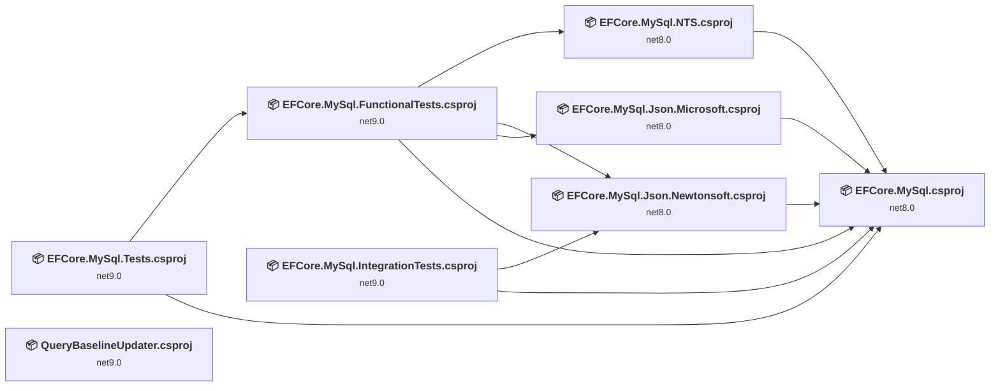
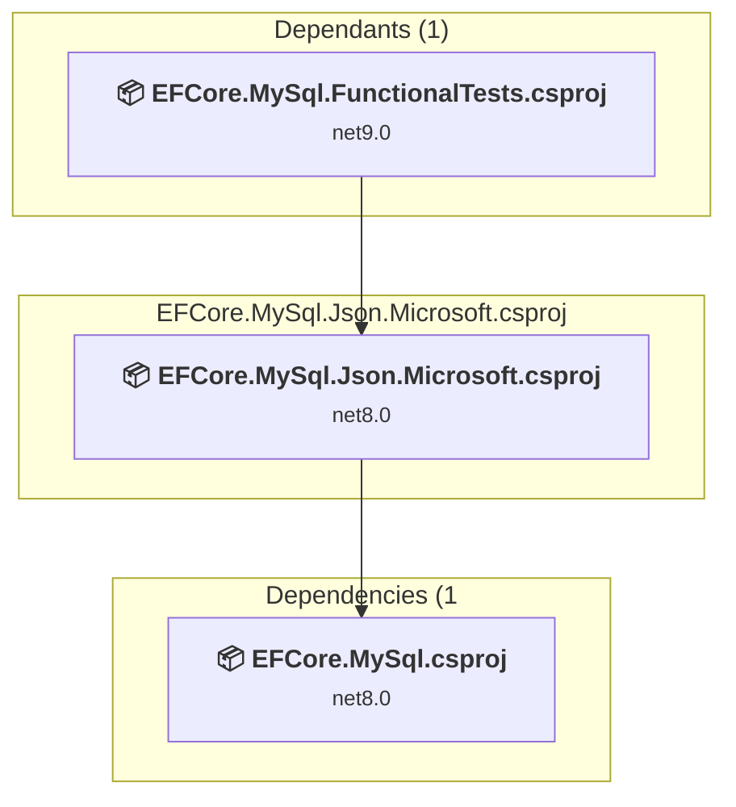
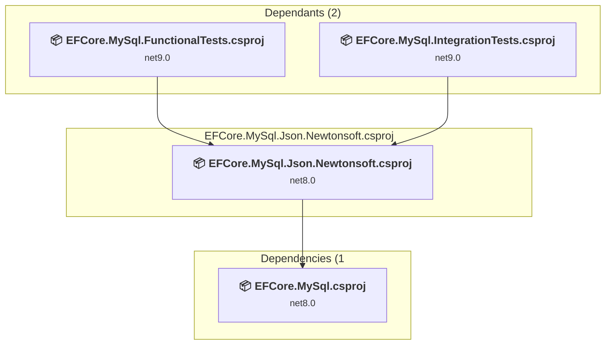
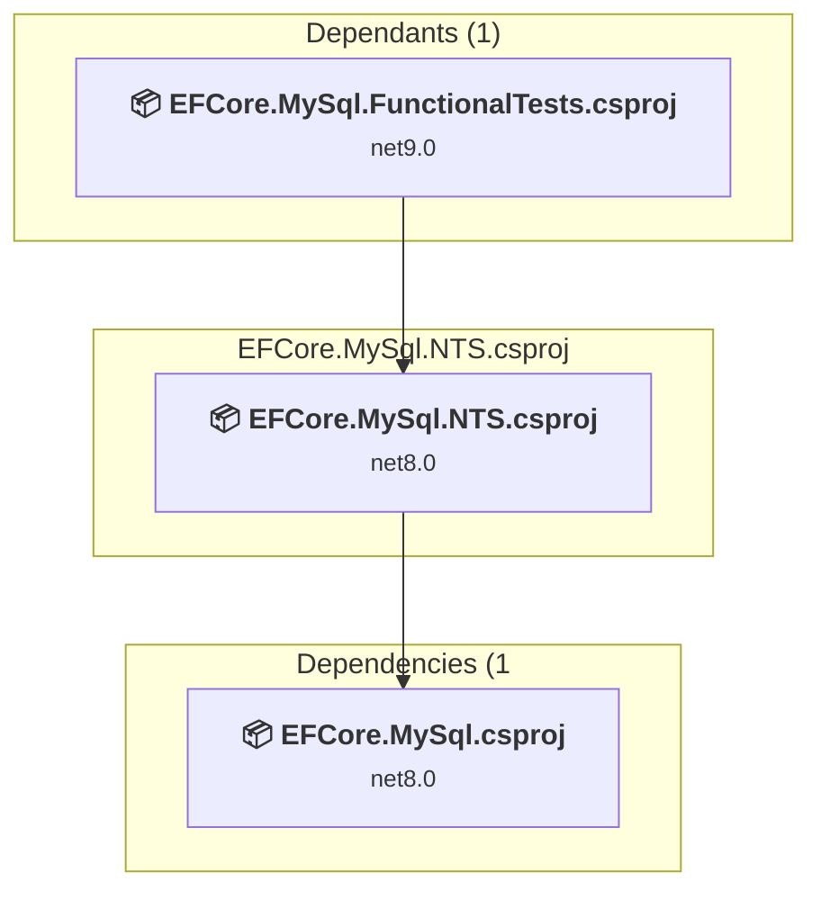
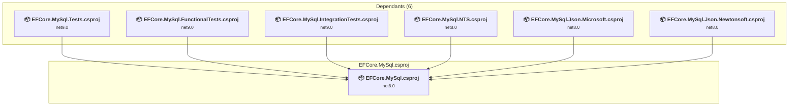
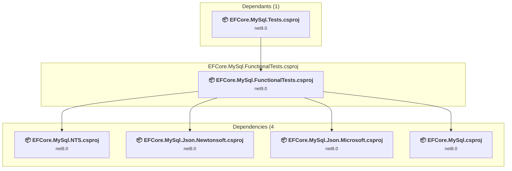
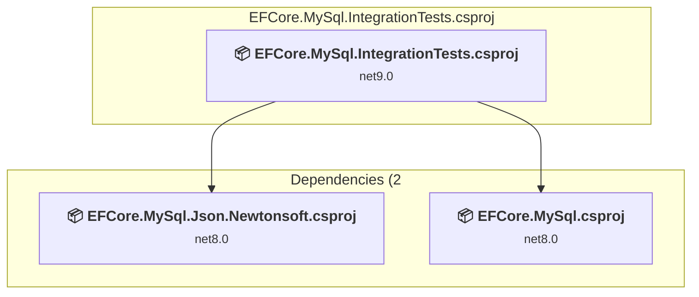
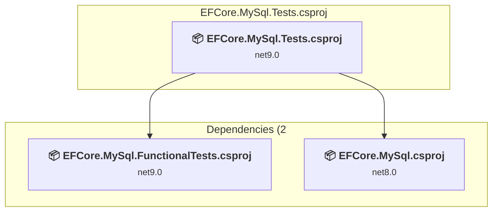
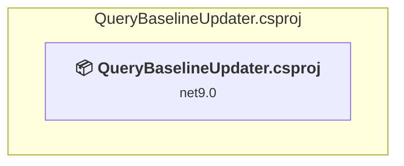

# Projects and dependencies analysis

This document provides a comprehensive overview of the projects and their dependencies in the context of upgrading to .NETCoreApp,Version=v10.0.

## Table of Contents

- [Executive Summary](#executive-Summary)
  - [Highlevel Metrics](#highlevel-metrics)
  - [Projects Compatibility](#projects-compatibility)
  - [Package Compatibility](#package-compatibility)
  - [API Compatibility](#api-compatibility)
- [Aggregate NuGet packages details](#aggregate-nuget-packages-details)
- [Top API Migration Challenges](#top-api-migration-challenges)
  - [Technologies and Features](#technologies-and-features)
  - [Most Frequent API Issues](#most-frequent-api-issues)
- [Projects Relationship Graph](#projects-relationship-graph)
- [Project Details](#project-details)

  - [src\EFCore.MySql.Json.Microsoft\EFCore.MySql.Json.Microsoft.csproj](#srcefcoremysqljsonmicrosoftefcoremysqljsonmicrosoftcsproj)
  - [src\EFCore.MySql.Json.Newtonsoft\EFCore.MySql.Json.Newtonsoft.csproj](#srcefcoremysqljsonnewtonsoftefcoremysqljsonnewtonsoftcsproj)
  - [src\EFCore.MySql.NTS\EFCore.MySql.NTS.csproj](#srcefcoremysqlntsefcoremysqlntscsproj)
  - [src\EFCore.MySql\EFCore.MySql.csproj](#srcefcoremysqlefcoremysqlcsproj)
  - [test\EFCore.MySql.FunctionalTests\EFCore.MySql.FunctionalTests.csproj](#testefcoremysqlfunctionaltestsefcoremysqlfunctionaltestscsproj)
  - [test\EFCore.MySql.IntegrationTests\EFCore.MySql.IntegrationTests.csproj](#testefcoremysqlintegrationtestsefcoremysqlintegrationtestscsproj)
  - [test\EFCore.MySql.Tests\EFCore.MySql.Tests.csproj](#testefcoremysqltestsefcoremysqltestscsproj)
  - [tools\QueryBaselineUpdater\QueryBaselineUpdater.csproj](#toolsquerybaselineupdaterquerybaselineupdatercsproj)

## Executive Summary

### Highlevel Metrics

| Metric | Count | Status |
| :--- | :---: | :--- |
| Total Projects | 8 | All require upgrade |
| Total NuGet Packages | 28 | 13 need upgrade |
| Total Code Files | 622 |  |
| Total Code Files with Incidents | 28 |  |
| Total Lines of Code | 127534 |  |
| Total Number of Issues | 146 |  |
| Estimated LOC to modify | 113+ | at least 0,1% of codebase |

### Projects Compatibility

| Project | Target Framework | Difficulty | Package Issues | API Issues | Est. LOC Impact | Description |
| :--- | :---: | :---: | :---: | :---: | :---: | :--- |
| [src\EFCore.MySql.Json.Microsoft\EFCore.MySql.Json.Microsoft.csproj](#srcefcoremysqljsonmicrosoftefcoremysqljsonmicrosoftcsproj) | net8.0 | 🟢 Low | 1 | 10 | 10+ | ClassLibrary, Sdk Style = True |
| [src\EFCore.MySql.Json.Newtonsoft\EFCore.MySql.Json.Newtonsoft.csproj](#srcefcoremysqljsonnewtonsoftefcoremysqljsonnewtonsoftcsproj) | net8.0 | 🟢 Low | 3 | 0 |  | ClassLibrary, Sdk Style = True |
| [src\EFCore.MySql.NTS\EFCore.MySql.NTS.csproj](#srcefcoremysqlntsefcoremysqlntscsproj) | net8.0 | 🟢 Low | 2 | 0 |  | ClassLibrary, Sdk Style = True |
| [src\EFCore.MySql\EFCore.MySql.csproj](#srcefcoremysqlefcoremysqlcsproj) | net8.0 | 🟢 Low | 1 | 0 |  | ClassLibrary, Sdk Style = True |
| [test\EFCore.MySql.FunctionalTests\EFCore.MySql.FunctionalTests.csproj](#testefcoremysqlfunctionaltestsefcoremysqlfunctionaltestscsproj) | net9.0 | 🟢 Low | 8 | 76 | 76+ | DotNetCoreApp, Sdk Style = True |
| [test\EFCore.MySql.IntegrationTests\EFCore.MySql.IntegrationTests.csproj](#testefcoremysqlintegrationtestsefcoremysqlintegrationtestscsproj) | net9.0 | 🟢 Low | 5 | 21 | 21+ | AspNetCore, Sdk Style = True |
| [test\EFCore.MySql.Tests\EFCore.MySql.Tests.csproj](#testefcoremysqltestsefcoremysqltestscsproj) | net9.0 | 🟢 Low | 5 | 6 | 6+ | DotNetCoreApp, Sdk Style = True |
| [tools\QueryBaselineUpdater\QueryBaselineUpdater.csproj](#toolsquerybaselineupdaterquerybaselineupdatercsproj) | net9.0 | 🟢 Low | 0 | 0 |  | DotNetCoreApp, Sdk Style = True |

### Package Compatibility

| Status | Count | Percentage |
| :--- | :---: | :---: |
| ✅ Compatible | 15 | 53,6% |
| ⚠️ Incompatible | 0 | 0,0% |
| 🔄 Upgrade Recommended | 13 | 46,4% |
| ***Total NuGet Packages*** | ***28*** | ***100%*** |

### API Compatibility

| Category | Count | Impact |
| :--- | :---: | :--- |
| 🔴 Binary Incompatible | 0 | High - Require code changes |
| 🟡 Source Incompatible | 56 | Medium - Needs re-compilation and potential conflicting API error fixing |
| 🔵 Behavioral change | 57 | Low - Behavioral changes that may require testing at runtime |
| ✅ Compatible | 120190 |  |
| ***Total APIs Analyzed*** | ***120303*** |  |

## Aggregate NuGet packages details

| Package | Current Version | Suggested Version | Projects | Description |
| :--- | :---: | :---: | :--- | :--- |
| DotNetAnalyzers.DocumentationAnalyzers | 1.0.0-beta.59 |  | [EFCore.MySql.csproj](#srcefcoremysqlefcoremysqlcsproj) [EFCore.MySql.Json.Microsoft.csproj](#srcefcoremysqljsonmicrosoftefcoremysqljsonmicrosoftcsproj) [EFCore.MySql.Json.Newtonsoft.csproj](#srcefcoremysqljsonnewtonsoftefcoremysqljsonnewtonsoftcsproj) [EFCore.MySql.NTS.csproj](#srcefcoremysqlntsefcoremysqlntscsproj) | ✅Compatible |
| GitHubActionsTestLogger | 2.4.1 |  | [EFCore.MySql.FunctionalTests.csproj](#testefcoremysqlfunctionaltestsefcoremysqlfunctionaltestscsproj) [EFCore.MySql.IntegrationTests.csproj](#testefcoremysqlintegrationtestsefcoremysqlintegrationtestscsproj) [EFCore.MySql.Tests.csproj](#testefcoremysqltestsefcoremysqltestscsproj) | ✅Compatible |
| Microsoft.AspNetCore.Identity.EntityFrameworkCore | 9.0.0 | 10.0.5 | [EFCore.MySql.IntegrationTests.csproj](#testefcoremysqlintegrationtestsefcoremysqlintegrationtestscsproj) | NuGet package upgrade is recommended |
| Microsoft.AspNetCore.Mvc.NewtonsoftJson | 9.0.0 | 10.0.5 | [EFCore.MySql.IntegrationTests.csproj](#testefcoremysqlintegrationtestsefcoremysqlintegrationtestscsproj) | NuGet package upgrade is recommended |
| Microsoft.CodeAnalysis | 4.10.0 |  | [EFCore.MySql.IntegrationTests.csproj](#testefcoremysqlintegrationtestsefcoremysqlintegrationtestscsproj) [EFCore.MySql.Tests.csproj](#testefcoremysqltestsefcoremysqltestscsproj) | ✅Compatible |
| Microsoft.EntityFrameworkCore | 9.0.0 | 10.0.5 | [EFCore.MySql.FunctionalTests.csproj](#testefcoremysqlfunctionaltestsefcoremysqlfunctionaltestscsproj) | NuGet package upgrade is recommended |
| Microsoft.EntityFrameworkCore.Design | 9.0.0 | 10.0.5 | [EFCore.MySql.FunctionalTests.csproj](#testefcoremysqlfunctionaltestsefcoremysqlfunctionaltestscsproj) [EFCore.MySql.IntegrationTests.csproj](#testefcoremysqlintegrationtestsefcoremysqlintegrationtestscsproj) [EFCore.MySql.Tests.csproj](#testefcoremysqltestsefcoremysqltestscsproj) | NuGet package upgrade is recommended |
| Microsoft.EntityFrameworkCore.Relational | 9.0.0 | 10.0.5 | [EFCore.MySql.csproj](#srcefcoremysqlefcoremysqlcsproj) [EFCore.MySql.FunctionalTests.csproj](#testefcoremysqlfunctionaltestsefcoremysqlfunctionaltestscsproj) [EFCore.MySql.Json.Microsoft.csproj](#srcefcoremysqljsonmicrosoftefcoremysqljsonmicrosoftcsproj) [EFCore.MySql.Json.Newtonsoft.csproj](#srcefcoremysqljsonnewtonsoftefcoremysqljsonnewtonsoftcsproj) [EFCore.MySql.NTS.csproj](#srcefcoremysqlntsefcoremysqlntscsproj) [EFCore.MySql.Tests.csproj](#testefcoremysqltestsefcoremysqltestscsproj) | NuGet package upgrade is recommended |
| Microsoft.EntityFrameworkCore.Relational.Specification.Tests | 9.0.0 | 10.0.5 | [EFCore.MySql.FunctionalTests.csproj](#testefcoremysqlfunctionaltestsefcoremysqlfunctionaltestscsproj) [EFCore.MySql.IntegrationTests.csproj](#testefcoremysqlintegrationtestsefcoremysqlintegrationtestscsproj) [EFCore.MySql.Tests.csproj](#testefcoremysqltestsefcoremysqltestscsproj) | NuGet package upgrade is recommended |
| Microsoft.Extensions.Configuration.Binder | 9.0.0 | 10.0.5 | [EFCore.MySql.FunctionalTests.csproj](#testefcoremysqlfunctionaltestsefcoremysqlfunctionaltestscsproj) | NuGet package upgrade is recommended |
| Microsoft.Extensions.Configuration.EnvironmentVariables | 9.0.0 | 10.0.5 | [EFCore.MySql.FunctionalTests.csproj](#testefcoremysqlfunctionaltestsefcoremysqlfunctionaltestscsproj) | NuGet package upgrade is recommended |
| Microsoft.Extensions.Configuration.FileExtensions | 9.0.0 | 10.0.5 | [EFCore.MySql.FunctionalTests.csproj](#testefcoremysqlfunctionaltestsefcoremysqlfunctionaltestscsproj) | NuGet package upgrade is recommended |
| Microsoft.Extensions.Configuration.Json | 9.0.0 | 10.0.5 | [EFCore.MySql.FunctionalTests.csproj](#testefcoremysqlfunctionaltestsefcoremysqlfunctionaltestscsproj) | NuGet package upgrade is recommended |
| Microsoft.Extensions.DependencyInjection | 9.0.0 | 10.0.5 | [EFCore.MySql.Json.Newtonsoft.csproj](#srcefcoremysqljsonnewtonsoftefcoremysqljsonnewtonsoftcsproj) [EFCore.MySql.NTS.csproj](#srcefcoremysqlntsefcoremysqlntscsproj) | NuGet package upgrade is recommended |
| Microsoft.Extensions.DependencyModel | 9.0.0 | 10.0.5 | [EFCore.MySql.Tests.csproj](#testefcoremysqltestsefcoremysqltestscsproj) | NuGet package upgrade is recommended |
| Microsoft.NET.Test.Sdk | 17.12.0 |  | [EFCore.MySql.FunctionalTests.csproj](#testefcoremysqlfunctionaltestsefcoremysqlfunctionaltestscsproj) [EFCore.MySql.IntegrationTests.csproj](#testefcoremysqlintegrationtestsefcoremysqlintegrationtestscsproj) [EFCore.MySql.Tests.csproj](#testefcoremysqltestsefcoremysqltestscsproj) | ✅Compatible |
| Microsoft.SourceLink.GitHub | 8.0.0 |  | [EFCore.MySql.csproj](#srcefcoremysqlefcoremysqlcsproj) [EFCore.MySql.Json.Microsoft.csproj](#srcefcoremysqljsonmicrosoftefcoremysqljsonmicrosoftcsproj) [EFCore.MySql.Json.Newtonsoft.csproj](#srcefcoremysqljsonnewtonsoftefcoremysqljsonnewtonsoftcsproj) [EFCore.MySql.NTS.csproj](#srcefcoremysqlntsefcoremysqlntscsproj) | ✅Compatible |
| Moq | 4.20.72 |  | [EFCore.MySql.Tests.csproj](#testefcoremysqltestsefcoremysqltestscsproj) | ✅Compatible |
| MySqlConnector | 2.4.0 |  | [EFCore.MySql.csproj](#srcefcoremysqlefcoremysqlcsproj) [EFCore.MySql.FunctionalTests.csproj](#testefcoremysqlfunctionaltestsefcoremysqlfunctionaltestscsproj) [EFCore.MySql.IntegrationTests.csproj](#testefcoremysqlintegrationtestsefcoremysqlintegrationtestscsproj) [EFCore.MySql.Json.Microsoft.csproj](#srcefcoremysqljsonmicrosoftefcoremysqljsonmicrosoftcsproj) [EFCore.MySql.Json.Newtonsoft.csproj](#srcefcoremysqljsonnewtonsoftefcoremysqljsonnewtonsoftcsproj) [EFCore.MySql.NTS.csproj](#srcefcoremysqlntsefcoremysqlntscsproj) [EFCore.MySql.Tests.csproj](#testefcoremysqltestsefcoremysqltestscsproj) | ✅Compatible |
| MySqlConnector.DependencyInjection | 2.4.0 |  | [EFCore.MySql.Tests.csproj](#testefcoremysqltestsefcoremysqltestscsproj) | ✅Compatible |
| NetTopologySuite | 2.5.0 |  | [EFCore.MySql.NTS.csproj](#srcefcoremysqlntsefcoremysqlntscsproj) | ✅Compatible |
| Newtonsoft.Json | 13.0.3 | 13.0.4 | [EFCore.MySql.IntegrationTests.csproj](#testefcoremysqlintegrationtestsefcoremysqlintegrationtestscsproj) [EFCore.MySql.Json.Newtonsoft.csproj](#srcefcoremysqljsonnewtonsoftefcoremysqljsonnewtonsoftcsproj) [EFCore.MySql.Tests.csproj](#testefcoremysqltestsefcoremysqltestscsproj) | NuGet package upgrade is recommended |
| StyleCop.Analyzers | 1.1.118 |  | [EFCore.MySql.csproj](#srcefcoremysqlefcoremysqlcsproj) | ✅Compatible |
| xunit.assert | 2.9.2 |  | [EFCore.MySql.FunctionalTests.csproj](#testefcoremysqlfunctionaltestsefcoremysqlfunctionaltestscsproj) [EFCore.MySql.IntegrationTests.csproj](#testefcoremysqlintegrationtestsefcoremysqlintegrationtestscsproj) [EFCore.MySql.Tests.csproj](#testefcoremysqltestsefcoremysqltestscsproj) | ✅Compatible |
| xunit.core | 2.9.2 |  | [EFCore.MySql.FunctionalTests.csproj](#testefcoremysqlfunctionaltestsefcoremysqlfunctionaltestscsproj) [EFCore.MySql.IntegrationTests.csproj](#testefcoremysqlintegrationtestsefcoremysqlintegrationtestscsproj) [EFCore.MySql.Tests.csproj](#testefcoremysqltestsefcoremysqltestscsproj) | ✅Compatible |
| xunit.runner.console | 2.9.2 |  | [EFCore.MySql.FunctionalTests.csproj](#testefcoremysqlfunctionaltestsefcoremysqlfunctionaltestscsproj) [EFCore.MySql.IntegrationTests.csproj](#testefcoremysqlintegrationtestsefcoremysqlintegrationtestscsproj) [EFCore.MySql.Tests.csproj](#testefcoremysqltestsefcoremysqltestscsproj) | ✅Compatible |
| xunit.runner.visualstudio | 2.8.2 |  | [EFCore.MySql.FunctionalTests.csproj](#testefcoremysqlfunctionaltestsefcoremysqlfunctionaltestscsproj) [EFCore.MySql.IntegrationTests.csproj](#testefcoremysqlintegrationtestsefcoremysqlintegrationtestscsproj) [EFCore.MySql.Tests.csproj](#testefcoremysqltestsefcoremysqltestscsproj) | ✅Compatible |
| Xunit.SkippableFact | 1.4.13 |  | [EFCore.MySql.FunctionalTests.csproj](#testefcoremysqlfunctionaltestsefcoremysqlfunctionaltestscsproj) [EFCore.MySql.IntegrationTests.csproj](#testefcoremysqlintegrationtestsefcoremysqlintegrationtestscsproj) [EFCore.MySql.Tests.csproj](#testefcoremysqltestsefcoremysqltestscsproj) | ✅Compatible |

## Top API Migration Challenges

### Technologies and Features

| Technology | Issues | Percentage | Migration Path |
| :--- | :---: | :---: | :--- |

### Most Frequent API Issues

| API | Count | Percentage | Category |
| :--- | :---: | :---: | :--- |
| T:System.Text.Json.JsonDocument | 53 | 46,9% | Behavioral Change |
| M:System.TimeSpan.FromHours(System.Double) | 26 | 23,0% | Source Incompatible |
| M:System.TimeSpan.FromSeconds(System.Int64) | 6 | 5,3% | Source Incompatible |
| M:System.TimeSpan.FromMilliseconds(System.Double) | 5 | 4,4% | Source Incompatible |
| M:System.TimeSpan.FromHours(System.Int32) | 4 | 3,5% | Source Incompatible |
| T:Microsoft.AspNetCore.Hosting.IWebHost | 3 | 2,7% | Source Incompatible |
| M:Microsoft.Extensions.Logging.ConsoleLoggerExtensions.AddConsole(Microsoft.Extensions.Logging.ILoggingBuilder) | 3 | 2,7% | Behavioral Change |
| M:System.TimeSpan.FromMilliseconds(System.Int64,System.Int64) | 2 | 1,8% | Source Incompatible |
| T:Microsoft.Extensions.DependencyModel.DependencyContext | 2 | 1,8% | Source Incompatible |
| M:System.ValueType.Equals(System.Object) | 1 | 0,9% | Behavioral Change |
| M:System.String.Join(System.String,System.ReadOnlySpan{System.String}) | 1 | 0,9% | Source Incompatible |
| T:Microsoft.AspNetCore.WebHost | 1 | 0,9% | Source Incompatible |
| T:Microsoft.Extensions.DependencyInjection.IdentityEntityFrameworkBuilderExtensions | 1 | 0,9% | Source Incompatible |
| M:Microsoft.Extensions.DependencyInjection.IdentityEntityFrameworkBuilderExtensions.AddEntityFrameworkStores''1(Microsoft.AspNetCore.Identity.IdentityBuilder) | 1 | 0,9% | Source Incompatible |
| T:Microsoft.Extensions.DependencyModel.CompilationLibrary | 1 | 0,9% | Source Incompatible |
| M:Microsoft.Extensions.DependencyModel.CompilationLibrary.ResolveReferencePaths | 1 | 0,9% | Source Incompatible |
| P:Microsoft.Extensions.DependencyModel.DependencyContext.Default | 1 | 0,9% | Source Incompatible |
| P:Microsoft.Extensions.DependencyModel.DependencyContext.CompileLibraries | 1 | 0,9% | Source Incompatible |

## Projects Relationship Graph

Legend:
📦 SDK-style project
⚙️ Classic project

## Project Details

### src\EFCore.MySql.Json.Microsoft\EFCore.MySql.Json.Microsoft.csproj

#### Project Info

- **Current Target Framework:** net8.0
- **Proposed Target Framework:** net10.0
- **SDK-style**: True
- **Project Kind:** ClassLibrary
- **Dependencies**: 1
- **Dependants**: 1
- **Number of Files**: 28
- **Number of Files with Incidents**: 4
- **Lines of Code**: 2092
- **Estimated LOC to modify**: 10+ (at least 0,5% of the project)

#### Dependency Graph

Legend:
📦 SDK-style project
⚙️ Classic project

### API Compatibility

| Category | Count | Impact |
| :--- | :---: | :--- |
| 🔴 Binary Incompatible | 0 | High - Require code changes |
| 🟡 Source Incompatible | 0 | Medium - Needs re-compilation and potential conflicting API error fixing |
| 🔵 Behavioral change | 10 | Low - Behavioral changes that may require testing at runtime |
| ✅ Compatible | 2073 |  |
| ***Total APIs Analyzed*** | ***2083*** |  |

### src\EFCore.MySql.Json.Newtonsoft\EFCore.MySql.Json.Newtonsoft.csproj

#### Project Info

- **Current Target Framework:** net8.0
- **Proposed Target Framework:** net10.0
- **SDK-style**: True
- **Project Kind:** ClassLibrary
- **Dependencies**: 1
- **Dependants**: 2
- **Number of Files**: 27
- **Number of Files with Incidents**: 1
- **Lines of Code**: 1870
- **Estimated LOC to modify**: 0+ (at least 0,0% of the project)

#### Dependency Graph

Legend:
📦 SDK-style project
⚙️ Classic project

### API Compatibility

| Category | Count | Impact |
| :--- | :---: | :--- |
| 🔴 Binary Incompatible | 0 | High - Require code changes |
| 🟡 Source Incompatible | 0 | Medium - Needs re-compilation and potential conflicting API error fixing |
| 🔵 Behavioral change | 0 | Low - Behavioral changes that may require testing at runtime |
| ✅ Compatible | 1994 |  |
| ***Total APIs Analyzed*** | ***1994*** |  |

### src\EFCore.MySql.NTS\EFCore.MySql.NTS.csproj

#### Project Info

- **Current Target Framework:** net8.0
- **Proposed Target Framework:** net10.0
- **SDK-style**: True
- **Project Kind:** ClassLibrary
- **Dependencies**: 1
- **Dependants**: 1
- **Number of Files**: 33
- **Number of Files with Incidents**: 1
- **Lines of Code**: 3024
- **Estimated LOC to modify**: 0+ (at least 0,0% of the project)

#### Dependency Graph

Legend:
📦 SDK-style project
⚙️ Classic project

### API Compatibility

| Category | Count | Impact |
| :--- | :---: | :--- |
| 🔴 Binary Incompatible | 0 | High - Require code changes |
| 🟡 Source Incompatible | 0 | Medium - Needs re-compilation and potential conflicting API error fixing |
| 🔵 Behavioral change | 0 | Low - Behavioral changes that may require testing at runtime |
| ✅ Compatible | 2950 |  |
| ***Total APIs Analyzed*** | ***2950*** |  |

### src\EFCore.MySql\EFCore.MySql.csproj

#### Project Info

- **Current Target Framework:** net8.0
- **Proposed Target Framework:** net10.0
- **SDK-style**: True
- **Project Kind:** ClassLibrary
- **Dependencies**: 0
- **Dependants**: 6
- **Number of Files**: 204
- **Number of Files with Incidents**: 1
- **Lines of Code**: 31151
- **Estimated LOC to modify**: 0+ (at least 0,0% of the project)

#### Dependency Graph

Legend:
📦 SDK-style project
⚙️ Classic project

### API Compatibility

| Category | Count | Impact |
| :--- | :---: | :--- |
| 🔴 Binary Incompatible | 0 | High - Require code changes |
| 🟡 Source Incompatible | 0 | Medium - Needs re-compilation and potential conflicting API error fixing |
| 🔵 Behavioral change | 0 | Low - Behavioral changes that may require testing at runtime |
| ✅ Compatible | 37080 |  |
| ***Total APIs Analyzed*** | ***37080*** |  |

### test\EFCore.MySql.FunctionalTests\EFCore.MySql.FunctionalTests.csproj

#### Project Info

- **Current Target Framework:** net9.0
- **Proposed Target Framework:** net10.0
- **SDK-style**: True
- **Project Kind:** DotNetCoreApp
- **Dependencies**: 4
- **Dependants**: 1
- **Number of Files**: 270
- **Number of Files with Incidents**: 11
- **Lines of Code**: 83092
- **Estimated LOC to modify**: 76+ (at least 0,1% of the project)

#### Dependency Graph

Legend:
📦 SDK-style project
⚙️ Classic project

### API Compatibility

| Category | Count | Impact |
| :--- | :---: | :--- |
| 🔴 Binary Incompatible | 0 | High - Require code changes |
| 🟡 Source Incompatible | 32 | Medium - Needs re-compilation and potential conflicting API error fixing |
| 🔵 Behavioral change | 44 | Low - Behavioral changes that may require testing at runtime |
| ✅ Compatible | 64417 |  |
| ***Total APIs Analyzed*** | ***64493*** |  |

### test\EFCore.MySql.IntegrationTests\EFCore.MySql.IntegrationTests.csproj

#### Project Info

- **Current Target Framework:** net9.0
- **Proposed Target Framework:** net10.0
- **SDK-style**: True
- **Project Kind:** AspNetCore
- **Dependencies**: 2
- **Dependants**: 0
- **Number of Files**: 42
- **Number of Files with Incidents**: 7
- **Lines of Code**: 3117
- **Estimated LOC to modify**: 21+ (at least 0,7% of the project)

#### Dependency Graph

Legend:
📦 SDK-style project
⚙️ Classic project

### API Compatibility

| Category | Count | Impact |
| :--- | :---: | :--- |
| 🔴 Binary Incompatible | 0 | High - Require code changes |
| 🟡 Source Incompatible | 18 | Medium - Needs re-compilation and potential conflicting API error fixing |
| 🔵 Behavioral change | 3 | Low - Behavioral changes that may require testing at runtime |
| ✅ Compatible | 7520 |  |
| ***Total APIs Analyzed*** | ***7541*** |  |

### test\EFCore.MySql.Tests\EFCore.MySql.Tests.csproj

#### Project Info

- **Current Target Framework:** net9.0
- **Proposed Target Framework:** net10.0
- **SDK-style**: True
- **Project Kind:** DotNetCoreApp
- **Dependencies**: 2
- **Dependants**: 0
- **Number of Files**: 30
- **Number of Files with Incidents**: 2
- **Lines of Code**: 3039
- **Estimated LOC to modify**: 6+ (at least 0,2% of the project)

#### Dependency Graph

Legend:
📦 SDK-style project
⚙️ Classic project

### API Compatibility

| Category | Count | Impact |
| :--- | :---: | :--- |
| 🔴 Binary Incompatible | 0 | High - Require code changes |
| 🟡 Source Incompatible | 6 | Medium - Needs re-compilation and potential conflicting API error fixing |
| 🔵 Behavioral change | 0 | Low - Behavioral changes that may require testing at runtime |
| ✅ Compatible | 3877 |  |
| ***Total APIs Analyzed*** | ***3883*** |  |

### tools\QueryBaselineUpdater\QueryBaselineUpdater.csproj

#### Project Info

- **Current Target Framework:** net9.0
- **Proposed Target Framework:** net10.0
- **SDK-style**: True
- **Project Kind:** DotNetCoreApp
- **Dependencies**: 0
- **Dependants**: 0
- **Number of Files**: 1
- **Number of Files with Incidents**: 1
- **Lines of Code**: 149
- **Estimated LOC to modify**: 0+ (at least 0,0% of the project)

#### Dependency Graph

Legend:
📦 SDK-style project
⚙️ Classic project

### API Compatibility

| Category | Count | Impact |
| :--- | :---: | :--- |
| 🔴 Binary Incompatible | 0 | High - Require code changes |
| 🟡 Source Incompatible | 0 | Medium - Needs re-compilation and potential conflicting API error fixing |
| 🔵 Behavioral change | 0 | Low - Behavioral changes that may require testing at runtime |
| ✅ Compatible | 279 |  |
| ***Total APIs Analyzed*** | ***279*** |  |

